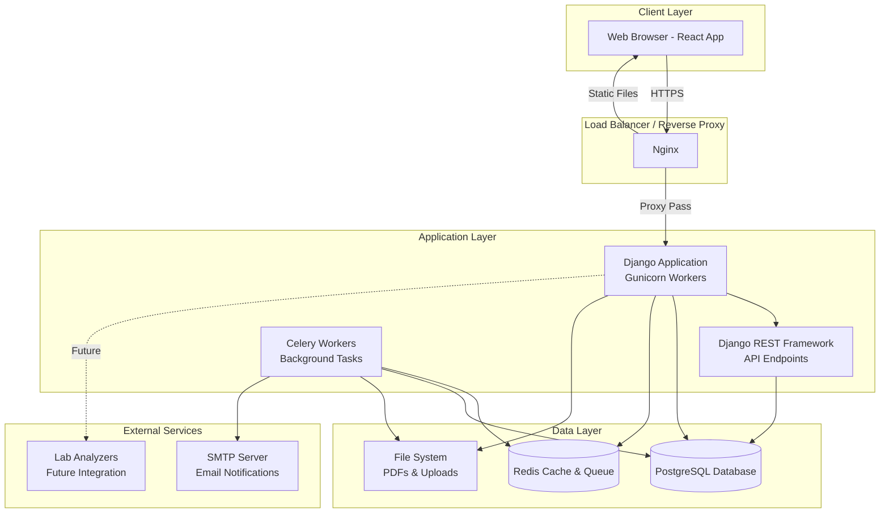
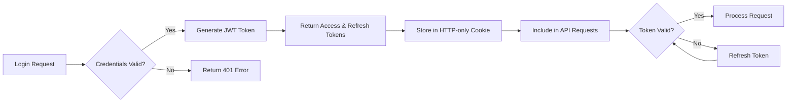
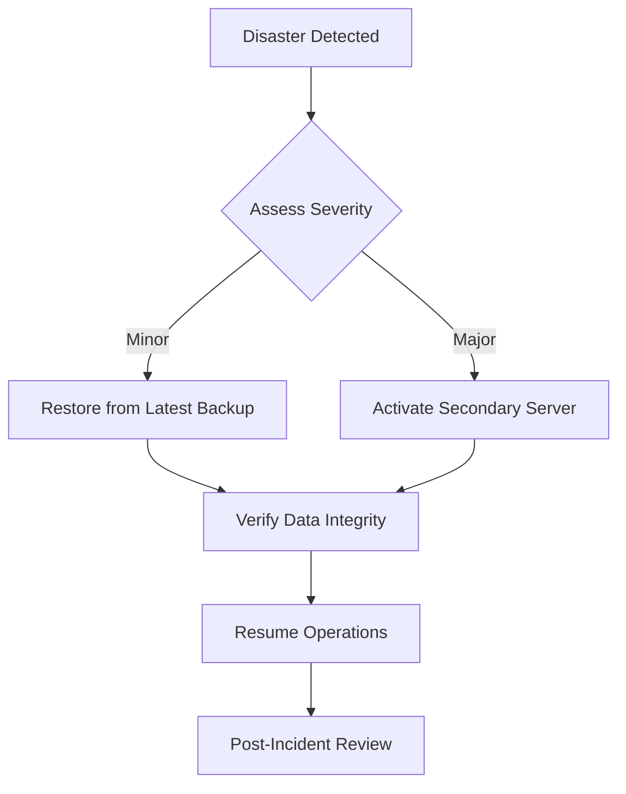
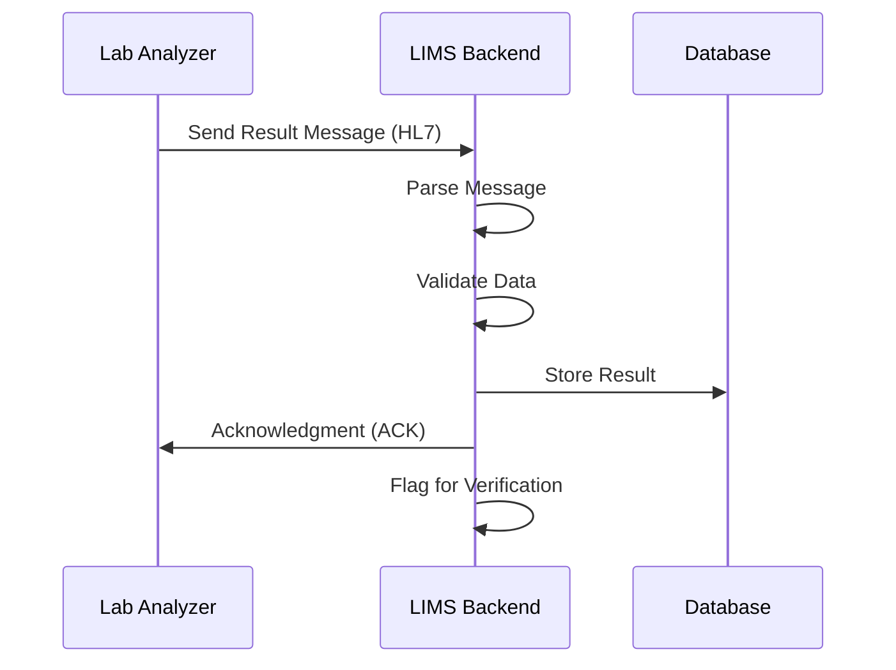
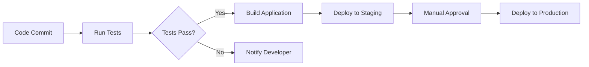

# Laboratory Information Management System
## System Architecture

---

## Technology Stack

### Backend
- **Framework**: Django 5.0+
- **API**: Django REST Framework (DRF)
- **Database**: PostgreSQL 15+
  - Chosen for ACID compliance, robust data integrity, excellent JSON support
  - Handles concurrent transactions efficiently (150+ orders/day = ~6-7 concurrent users)
  - Strong indexing and query optimization
  - Built-in full-text search
- **Authentication**: Django built-in auth + JWT tokens
- **Task Queue**: Celery with Redis
  - For PDF generation
  - Email notifications
  - Report archiving
- **File Storage**: Local file system with organized directory structure
- **PDF Generation**: ReportLab or WeasyPrint

### Frontend
- **Framework**: React 18+
- **State Management**: Redux Toolkit or Zustand
- **UI Components**: Material-UI (MUI) or Ant Design
- **Routing**: React Router v6
- **HTTP Client**: Axios
- **Form Management**: React Hook Form
- **Data Tables**: AG Grid or TanStack Table
- **Charts**: Recharts or Chart.js
- **PDF Viewer**: react-pdf

### Infrastructure
- **Deployment**: Cloud VPS (DigitalOcean, Linode, or AWS Lightsail)
- **Web Server**: Nginx (reverse proxy + static file serving)
- **Application Server**: Gunicorn or uWSGI
- **Process Manager**: Supervisor
- **Database Backup**: Automated daily backups with rotation
- **SSL/TLS**: Let's Encrypt (free SSL certificates)
- **Monitoring**: Basic logging + error tracking (Sentry optional)

### Development Tools
- **Version Control**: Git + GitHub/GitLab
- **Code Quality**: 
  - Backend: Black, Flake8, isort
  - Frontend: ESLint, Prettier
- **Testing**:
  - Backend: pytest, Django TestCase
  - Frontend: Jest, React Testing Library
- **API Documentation**: Swagger/OpenAPI (drf-spectacular)

---

## System Architecture Diagram



---

## Application Architecture

### Backend Architecture (Django)

```
lims-backend/
├── config/                     # Project configuration
│   ├── settings/
│   │   ├── base.py            # Base settings
│   │   ├── development.py     # Dev settings
│   │   └── production.py      # Prod settings
│   ├── urls.py                # Root URL configuration
│   └── wsgi.py                # WSGI entry point
│
├── apps/                      # Django applications
│   ├── accounts/              # User management
│   │   ├── models.py          # User model
│   │   ├── serializers.py     # User API serializers
│   │   ├── views.py           # User API views
│   │   └── permissions.py     # Role-based permissions
│   │
│   ├── patients/              # Patient management
│   │   ├── models.py          # Patient model
│   │   ├── serializers.py     # Patient serializers
│   │   ├── views.py           # Patient CRUD APIs
│   │   └── search.py          # Patient search functionality
│   │
│   ├── laboratory/            # Core lab functionality
│   │   ├── models/
│   │   │   ├── categories.py  # Test categories
│   │   │   ├── tests.py       # Tests and parameters
│   │   │   └── panels.py      # Test panels
│   │   ├── serializers/
│   │   ├── views/
│   │   └── admin.py           # Django admin customization
│   │
│   ├── orders/                # Order management
│   │   ├── models.py          # Orders, order items
│   │   ├── serializers.py
│   │   ├── views.py
│   │   ├── services.py        # Business logic
│   │   └── validators.py      # Order validation
│   │
│   ├── samples/               # Sample tracking
│   │   ├── models.py
│   │   ├── serializers.py
│   │   └── views.py
│   │
│   ├── results/               # Result management
│   │   ├── models.py          # Test results
│   │   ├── serializers.py
│   │   ├── views.py
│   │   ├── validators.py      # Result validation & flagging
│   │   └── verification.py    # Verification workflow
│   │
│   ├── reports/               # Report generation
│   │   ├── models.py
│   │   ├── generators/
│   │   │   ├── pdf.py         # PDF generation
│   │   │   └── templates/     # Report templates
│   │   ├── views.py
│   │   └── tasks.py           # Celery tasks
│   │
│   ├── billing/               # Billing & payments
│   │   ├── models.py
│   │   ├── serializers.py
│   │   ├── views.py
│   │   └── services.py        # Payment processing
│   │
│   └── audit/                 # Audit trail
│       ├── models.py          # Audit log
│       ├── middleware.py      # Auto-logging middleware
│       └── views.py           # Audit reports
│
├── media/                     # User uploads
│   ├── reports/               # Generated PDF reports
│   └── signatures/            # Digital signatures
│
├── static/                    # Static files
│   └── admin/                 # Django admin assets
│
├── templates/                 # Django templates
│   └── reports/               # Report HTML templates
│
├── requirements/
│   ├── base.txt              # Base dependencies
│   ├── development.txt       # Dev dependencies
│   └── production.txt        # Prod dependencies
│
└── manage.py
```

### Frontend Architecture (React)

```
lims-frontend/
├── public/
│   ├── index.html
│   └── favicon.ico
│
├── src/
│   ├── api/                   # API client configuration
│   │   ├── axios.js           # Axios instance
│   │   ├── endpoints.js       # API endpoint constants
│   │   └── services/          # API service functions
│   │       ├── patients.js
│   │       ├── orders.js
│   │       ├── results.js
│   │       └── reports.js
│   │
│   ├── components/            # Reusable components
│   │   ├── common/            # Generic components
│   │   │   ├── Button/
│   │   │   ├── Table/
│   │   │   ├── Modal/
│   │   │   └── SearchBar/
│   │   ├── layout/            # Layout components
│   │   │   ├── Header/
│   │   │   ├── Sidebar/
│   │   │   └── Footer/
│   │   └── forms/             # Form components
│   │       ├── PatientForm/
│   │       ├── OrderForm/
│   │       └── ResultForm/
│   │
│   ├── pages/                 # Page components
│   │   ├── Dashboard/
│   │   ├── Patients/
│   │   │   ├── PatientList.jsx
│   │   │   ├── PatientDetail.jsx
│   │   │   └── PatientCreate.jsx
│   │   ├── Orders/
│   │   │   ├── OrderList.jsx
│   │   │   ├── OrderCreate.jsx
│   │   │   └── OrderDetail.jsx
│   │   ├── SampleCollection/
│   │   ├── Results/
│   │   │   ├── ResultEntry.jsx
│   │   │   └── ResultVerification.jsx
│   │   ├── Reports/
│   │   │   ├── ReportList.jsx
│   │   │   └── ReportView.jsx
│   │   ├── Billing/
│   │   └── Settings/
│   │
│   ├── store/                 # State management
│   │   ├── index.js           # Store configuration
│   │   ├── slices/            # Redux slices
│   │   │   ├── authSlice.js
│   │   │   ├── patientSlice.js
│   │   │   ├── orderSlice.js
│   │   │   └── uiSlice.js
│   │   └── hooks.js           # Custom Redux hooks
│   │
│   ├── hooks/                 # Custom React hooks
│   │   ├── useDebounce.js
│   │   ├── useAsync.js
│   │   └── useAuth.js
│   │
│   ├── utils/                 # Utility functions
│   │   ├── formatters.js      # Data formatters
│   │   ├── validators.js      # Form validators
│   │   └── constants.js       # App constants
│   │
│   ├── routes/                # Routing configuration
│   │   ├── index.jsx          # Route definitions
│   │   ├── PrivateRoute.jsx   # Protected routes
│   │   └── RoleRoute.jsx      # Role-based routes
│   │
│   ├── styles/                # Global styles
│   │   ├── theme.js           # MUI theme
│   │   └── global.css         # Global CSS
│   │
│   ├── App.jsx                # Root component
│   └── index.jsx              # Entry point
│
├── package.json
└── vite.config.js            # Vite configuration
```

---

## Database Architecture

### Physical Schema Design

**Database Name**: `lims_db`

**Connection Pooling**: 
- Min connections: 5
- Max connections: 20
- Connection timeout: 30 seconds

**Partitioning Strategy** (Future optimization):
- `test_results` table partitioned by date (monthly)
- `orders` table partitioned by date (quarterly)

### Indexing Strategy

```sql
-- Frequently searched fields
CREATE INDEX idx_patients_phone ON patients(phone);
CREATE INDEX idx_patients_national_id ON patients(national_id);
CREATE INDEX idx_orders_order_id ON orders(order_id);
CREATE INDEX idx_orders_patient_date ON orders(patient_id, order_date DESC);
CREATE INDEX idx_orders_status ON orders(status);

-- Composite indexes for common queries
CREATE INDEX idx_test_results_order_test ON test_results(order_id, test_id);
CREATE INDEX idx_test_results_verification ON test_results(verified_by, verified_at) 
  WHERE verified_by IS NOT NULL;

-- Full-text search
CREATE INDEX idx_patients_name_fulltext ON patients 
  USING gin(to_tsvector('english', first_name || ' ' || last_name));
```

---

## Security Architecture

### Authentication & Authorization



### Role-Based Access Control (RBAC)

| Role | Permissions |
|------|------------|
| **Admin** | Full system access, user management, configuration |
| **Receptionist** | Patient registration, order creation, view orders |
| **Cashier** | View orders, record payments, generate receipts |
| **Phlebotomist** | View orders, record sample collection |
| **Lab Technician** | View assigned tests, enter results |
| **Pathologist** | View all results, verify results, approve reports |
| **Manager** | View all data, generate reports, no modifications |

### Data Security Measures

1. **Encryption**
   - In-transit: HTTPS/TLS 1.3
   - At-rest: Database encryption (optional, PostgreSQL TDE)
   - Passwords: bcrypt hashing (cost factor 12)

2. **API Security**
   - JWT token expiration: 1 hour (access), 7 days (refresh)
   - Rate limiting: 100 requests/minute per user
   - CORS configuration for frontend domain only
   - SQL injection prevention (Django ORM)
   - XSS protection (React escaping)

3. **Audit Trail**
   - Log all data modifications
   - Track user actions with timestamps
   - IP address logging
   - Immutable audit records

4. **Patient Data Privacy**
   - HIPAA-aligned practices
   - Access logs for patient data views
   - Data retention policies
   - Secure report delivery

---

## Deployment Architecture

### VPS Server Configuration

**Recommended Specs (150 orders/day)**:
- **CPU**: 2-4 vCPUs
- **RAM**: 4-8 GB
- **Storage**: 100 GB SSD
- **Bandwidth**: 2 TB/month
- **OS**: Ubuntu 22.04 LTS

### Service Architecture

```
┌─────────────────────────────────────────────────┐
│                  VPS Server                      │
│                                                  │
│  ┌──────────────────────────────────────────┐  │
│  │  Nginx (Port 80/443)                     │  │
│  │  - SSL Termination                        │  │
│  │  - Static File Serving                    │  │
│  │  - Reverse Proxy                          │  │
│  └──────────────┬───────────────────────────┘  │
│                 │                                │
│  ┌──────────────▼───────────────────────────┐  │
│  │  Gunicorn (Port 8000)                    │  │
│  │  - Django Application                     │  │
│  │  - 4 Worker Processes                     │  │
│  └──────────────┬───────────────────────────┘  │
│                 │                                │
│  ┌──────────────▼───────────────────────────┐  │
│  │  PostgreSQL (Port 5432)                  │  │
│  │  - Database Server                        │  │
│  └──────────────────────────────────────────┘  │
│                                                  │
│  ┌──────────────────────────────────────────┐  │
│  │  Redis (Port 6379)                       │  │
│  │  - Cache & Message Broker                │  │
│  └──────────────────────────────────────────┘  │
│                                                  │
│  ┌──────────────────────────────────────────┐  │
│  │  Celery Workers                          │  │
│  │  - Background Task Processing             │  │
│  └──────────────────────────────────────────┘  │
│                                                  │
│  ┌──────────────────────────────────────────┐  │
│  │  File System                             │  │
│  │  - /var/www/lims/media/reports/          │  │
│  │  - /var/www/lims/static/                 │  │
│  └──────────────────────────────────────────┘  │
└─────────────────────────────────────────────────┘
```

### Multiple Terminals Support

**Architecture**: Single database, multiple frontend instances

```
Terminal 1 (Reception)      Terminal 2 (Lab)      Terminal 3 (Billing)
      │                           │                       │
      └───────────────┬───────────┴───────────┬───────────┘
                      │                       │
              ┌───────▼───────┐      ┌────────▼────────┐
              │  Nginx Server │      │ Django Backend  │
              └───────────────┘      └─────────────────┘
                                             │
                                     ┌───────▼────────┐
                                     │   PostgreSQL   │
                                     └────────────────┘
```

All terminals access the same backend API with role-based permissions.

---

## API Architecture

### RESTful API Design Principles

1. **Resource-based URLs**
   - `/api/patients/` - Patient collection
   - `/api/patients/{id}/` - Specific patient
   - `/api/orders/` - Order collection

2. **HTTP Methods**
   - GET: Retrieve resources
   - POST: Create resources
   - PUT/PATCH: Update resources
   - DELETE: Delete resources

3. **Response Format**
   ```json
   {
     "success": true,
     "data": { ... },
     "message": "Operation successful",
     "errors": null
   }
   ```

4. **Pagination**
   ```json
   {
     "count": 150,
     "next": "http://api/patients/?page=2",
     "previous": null,
     "results": [ ... ]
   }
   ```

5. **Error Handling**
   ```json
   {
     "success": false,
     "data": null,
     "message": "Validation failed",
     "errors": {
       "phone": ["This field is required"],
       "email": ["Enter a valid email"]
     }
   }
   ```

---

## Scalability Considerations

### Current Architecture (Phase 1)
- **Capacity**: 150-300 orders/day
- **Users**: 5-15 concurrent users
- **Load**: Single VPS server

### Future Scalability (Phase 2-3)

1. **Horizontal Scaling**
   - Load balancer with multiple application servers
   - Database read replicas for reporting queries
   - Distributed Redis cluster

2. **Performance Optimization**
   - Database query optimization
   - Redis caching for frequently accessed data
   - CDN for static assets
   - Lazy loading in frontend

3. **Multi-Location Support**
   - Centralized database with location field
   - Branch-based data filtering
   - Location-specific configurations

---

## Backup & Disaster Recovery

### Backup Strategy

1. **Database Backups**
   - Automated daily backups (3 AM)
   - Retention: 30 days daily, 12 months monthly
   - Off-server backup storage
   - Automated backup verification

2. **File System Backups**
   - Daily backup of media files (reports, signatures)
   - Incremental backups
   - Cloud storage sync (optional)

3. **Recovery Time Objective (RTO)**
   - Target: 4 hours
   - Critical data recovery: 1 hour

4. **Recovery Point Objective (RPO)**
   - Target: 24 hours
   - Database point-in-time recovery available

### Disaster Recovery Plan



---

## Integration Architecture (Future)

### Lab Analyzer Integration (Placeholder)

**Communication Protocol**: HL7 v2.x or LIS2-A2



**Integration Points**:
- Analyzer sends results via TCP/IP or serial connection
- LIMS auto-imports results
- Technician reviews and confirms
- Reduces manual entry errors

---

## Monitoring & Logging

### Application Monitoring

1. **Logging Levels**
   - ERROR: Application errors, exceptions
   - WARNING: Unusual events, deprecated usage
   - INFO: Important events (login, order creation)
   - DEBUG: Detailed diagnostic (development only)

2. **Log Storage**
   - Application logs: `/var/log/lims/app.log`
   - Access logs: `/var/log/nginx/access.log`
   - Error logs: `/var/log/nginx/error.log`
   - Rotation: Daily, keep 30 days

3. **Health Checks**
   - `/api/health/` endpoint
   - Database connectivity check
   - Redis connectivity check
   - Disk space monitoring

4. **Performance Metrics**
   - API response times
   - Database query performance
   - Concurrent user count
   - PDF generation times

---

## Development Workflow

### Version Control Strategy

**Branching Model**: Git Flow

```
main (production-ready)
  ├── develop (integration branch)
  │   ├── feature/patient-registration
  │   ├── feature/order-management
  │   └── feature/report-generation
  ├── release/v1.0.0
  └── hotfix/critical-bug
```

### CI/CD Pipeline (Future)



---

## Technology Choices Rationale

### Why PostgreSQL?
- ✅ ACID compliance for financial transactions
- ✅ Complex query support (joins, aggregations)
- ✅ JSON field support for flexible data
- ✅ Strong community and enterprise support
- ✅ Excellent performance for 150-500 orders/day
- ✅ Free and open-source

### Why Django?
- ✅ Built-in admin panel for quick data management
- ✅ ORM prevents SQL injection
- ✅ Strong authentication system
- ✅ Excellent documentation
- ✅ Large ecosystem of packages
- ✅ Rapid development

### Why React?
- ✅ Component reusability
- ✅ Virtual DOM for performance
- ✅ Large community and ecosystem
- ✅ Excellent developer tools
- ✅ Easy to learn and maintain

### Why Redis?
- ✅ In-memory speed for caching
- ✅ Message broker for Celery
- ✅ Session storage
- ✅ Minimal resource overhead

---

## Performance Benchmarks

### Expected Performance (150 orders/day)

| Operation | Target Response Time | Notes |
|-----------|---------------------|--------|
| Patient Search | < 200ms | With proper indexing |
| Create Order | < 500ms | Including validations |
| Enter Results | < 300ms | Per parameter |
| Generate PDF | < 3 seconds | Standard report |
| Load Dashboard | < 1 second | With caching |
| API Response (avg) | < 300ms | 95th percentile |

### Resource Utilization (Normal Load)

| Resource | Average | Peak |
|----------|---------|------|
| CPU Usage | 15-25% | 40-60% |
| RAM Usage | 2-3 GB | 4-5 GB |
| Database Connections | 5-10 | 15-20 |
| Storage Growth | ~500 MB/month | Reports & backups |

---

## Future Architecture Enhancements (Phase 3)

1. **Microservices Architecture**
   - Separate services for orders, results, reports
   - API gateway for routing
   - Service mesh for inter-service communication

2. **Real-time Features**
   - WebSockets for live order status
   - Push notifications for critical values
   - Live dashboard updates

3. **Advanced Analytics**
   - Data warehouse for historical analysis
   - Business intelligence dashboard
   - Predictive analytics for inventory

4. **Mobile Application**
   - React Native app for sample collection
   - Patient mobile app for report access
   - Push notifications

This architecture provides a solid foundation for Phase 1 while being extensible for future phases.
