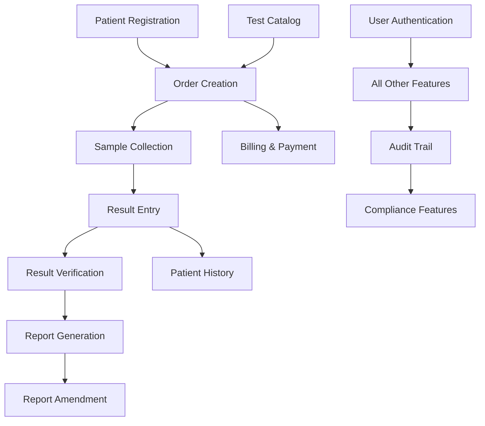

# LIMS Feature Priority Ranking

This document ranks all features by priority for the 3-phase implementation plan.

---

## Priority Levels

- **P0 (Critical)**: Must-have for MVP, system cannot function without it
- **P1 (High)**: Essential for Phase 1 completion
- **P2 (Medium)**: Important for Phase 2
- **P3 (Low)**: Nice-to-have for Phase 3

---

## Phase 1 Features (MVP - Weeks 1-8)

### P0 - Critical (Must-Have for Launch)

| Feature | Category | Justification |
|---------|----------|---------------|
| User Authentication | Security | Cannot operate without user login |
| Patient Registration | Core Workflow | Entry point for all lab work |
| Test Catalog Management | Core Data | Need tests to create orders |
| Order Creation | Core Workflow | Core business function |
| Payment Recording | Business Critical | Revenue tracking essential |
| Sample Collection Tracking | Core Workflow | Links orders to results |
| Result Entry | Core Workflow | Primary lab function |
| Result Verification | Quality/Compliance | Required for report generation |
| PDF Report Generation | Core Output | Final deliverable to patients |
| Basic Role-Based Access | Security | Prevent unauthorized access |

### P1 - High Priority (Essential for MVP)

| Feature | Category | Justification |
|---------|----------|---------------|
| Patient Search | Usability | Find existing patients quickly |
| Order Search & Filtering | Usability | Manage daily workload |
| Auto-calculation of Charges | Business Logic | Prevent pricing errors |
| Receipt Generation | Business | Required for payments |
| Work Lists (Pending Tasks) | Workflow | Staff need to know what to do |
| Auto-flagging Results | Quality | Identify abnormal results |
| Gender-specific Reference Ranges | Accuracy | Clinical requirement |
| Digital Signature Support | Compliance | Report authenticity |
| Order Status Tracking | Workflow | Visibility into progress |
| Basic Dashboard | User Experience | Overview of daily operations |

---

## Phase 2 Features (Enhanced - Weeks 9-13)

### P1 - High Priority

| Feature | Category | Justification |
|---------|----------|---------------|
| Patient Test History | Clinical Value | Compare results over time |
| Comparison of Last 5 Values | Clinical Value | Track trends |
| Comprehensive Audit Trail | Compliance | Regulatory requirement |
| Email Notifications | User Experience | Keep users informed |
| Advanced Analytics Dashboard | Management | Business insights |

### P2 - Medium Priority

| Feature | Category | Justification |
|---------|----------|---------------|
| Enhanced Search & Filters | Usability | Improve efficiency |
| Report Amendment Workflow | Quality | Handle corrections |
| Revenue Reports | Management | Financial tracking |
| Test Statistics | Management | Optimize offerings |
| Turnaround Time Analysis | Quality | Performance monitoring |
| Multi-Terminal Support | Operations | Multiple workstations |
| System Configuration UI | Administration | Easy setup |
| Analyzer Integration Framework | Future Prep | Reduce manual entry later |

---

## Phase 3 Features (Optimization - Weeks 14-16)

### P2 - Medium Priority

| Feature | Category | Justification |
|---------|----------|---------------|
| Performance Optimization | Technical | Handle growth |
| Redis Caching | Technical | Speed improvements |
| Database Query Optimization | Technical | Faster responses |
| Mobile-Responsive Design | User Experience | Use on tablets |
| Automated Backup System | Operations | Data protection |
| Multi-Location Framework | Scalability | Future expansion |

### P3 - Low Priority (Nice-to-Have)

| Feature | Category | Justification |
|---------|----------|---------------|
| Quality Control Module | Advanced | Beneficial but not critical |
| Inventory Management | Operations | Helpful but manual ok for now |
| Custom Report Builder | Advanced | Standard reports sufficient initially |
| QR Codes on Reports | Innovation | Cool but not essential |
| Scheduled Reports | Automation | Manual generation works |
| Barcode Generation | Automation | Manual labeling acceptable |
| Advanced Security Features | Security | Basic security sufficient Phase 1 |

---

## Deferred Features (Post-Launch)

These features are important but can wait until after the initial 3 phases:

| Feature | Target Phase | Reason for Deferral |
|---------|-------------|-------------------|
| Patient Portal | Phase 4 | External-facing, requires additional security |
| Insurance Integration | Phase 4 | Not required by user |
| Multi-Location (Full Support) | Phase 4 | Single location first |
| Mobile Apps (Native) | Phase 5 | Web responsive sufficient initially |
| Advanced HL7 Integration | Phase 4 | Placeholders sufficient for now |
| Real-time WebSocket Updates | Phase 5 | Not critical for operations |
| Data Warehouse & BI | Phase 5 | Current analytics sufficient |
| API for Third-Party Integrations | Phase 5 | No immediate need |

---

## Feature Dependencies

These features must be completed before dependent features can start:

---

## Risk-Based Prioritization

### High-Risk Features (Need Extra Attention)

1. **PDF Report Generation (P0)**
   - Risk: Complex layout, potential performance issues
   - Mitigation: Start early, extensive testing, consider multiple libraries

2. **Result Auto-Flagging (P1)**
   - Risk: Incorrect flagging could cause clinical issues
   - Mitigation: Thorough testing with various scenarios, pathologist review

3. **Payment & Billing (P0)**
   - Risk: Financial accuracy critical
   - Mitigation: Extensive validation, audit trail, reconciliation features

4. **Digital Signatures (P1)**
   - Risk: Security and authenticity concerns
   - Mitigation: Secure storage, encryption, clear verification process

5. **Audit Trail (P1)**
   - Risk: Performance impact, storage growth
   - Mitigation: Efficient design, archiving strategy, selective logging

### Low-Risk Features (Can Implement Quickly)

1. Patient Search
2. Basic Dashboard
3. Email Notifications
4. Receipt Generation
5. Work Lists

---

## User Role Priority

Different roles have different priority needs:

### Receptionist Priorities
1. Patient Registration (P0)
2. Order Creation (P0)
3. Patient Search (P1)
4. Order History (P1)

### Cashier Priorities
1. Payment Recording (P0)
2. Receipt Generation (P1)
3. Payment History (P1)
4. Revenue Reports (P2)

### Phlebotomist Priorities
1. Sample Collection (P0)
2. Pending Collections List (P1)
3. Barcode Support (P3)

### Lab Technician Priorities
1. Result Entry (P0)
2. Work List (P1)
3. Auto-Flagging (P1)
4. QC Module (P3)

### Pathologist Priorities
1. Result Verification (P0)
2. Report Generation (P0)
3. Patient History/Comparison (P1)
4. Critical Value Alerts (P1)
5. Digital Signature (P1)

### Manager Priorities
1. Dashboard (P1)
2. Analytics & Reports (P1)
3. Audit Trail (P1)
4. System Configuration (P2)

### Administrator Priorities
1. User Management (P0)
2. Test Catalog Management (P0)
3. System Settings (P2)
4. Backup Management (P2)

---

## Technical Debt Management

### Acceptable in Phase 1 (Fix in Phase 2-3)
- Basic UI design (enhance later)
- Limited error handling
- No caching (add Redis later)
- No database optimization beyond indexes
- Manual deployment process
- Basic logging only

### Not Acceptable (Must Fix Before Launch)
- Security vulnerabilities
- Data integrity issues
- Incorrect calculations
- Missing audit trails for critical actions
- Broken core workflow
- No input validation

---

## Feature Estimate (Person-Days)

### Phase 1 (Total: ~240 person-days, 8 weeks, 3 developers)

| Feature Group | Estimated Days | Priority |
|--------------|----------------|----------|
| Authentication & Users | 5 | P0 |
| Patient Management | 8 | P0 |
| Test Catalog Setup | 10 | P0 |
| Order Management | 12 | P0 |
| Billing & Payment | 8 | P0 |
| Sample Collection | 6 | P0 |
| Result Entry | 12 | P0 |
| Result Verification | 8 | P0 |
| Report Generation | 15 | P0 |
| React Frontend - Core | 40 | P0 |
| UI Components | 15 | P1 |
| Dashboard | 10 | P1 |
| Testing & Bug Fixes | 20 | P0 |
| Deployment | 5 | P0 |
| **Subtotal** | **174 days** | |
| **Buffer (30%)** | **66 days** | |
| **Total** | **240 days** | |

### Phase 2 (Total: ~150 person-days, 5 weeks, 3 developers)

| Feature Group | Estimated Days |
|--------------|----------------|
| Patient History & Comparison | 10 |
| Enhanced Reporting | 12 |
| Advanced Search | 8 |
| Audit Trail | 10 |
| Analytics Dashboard | 15 |
| Analyzer Integration Framework | 12 |
| Notifications | 8 |
| System Configuration | 8 |
| Multi-Terminal Testing | 5 |
| Testing & Refinement | 15 |
| **Subtotal** | **103 days** |
| **Buffer (30%)** | **47 days** |
| **Total** | **150 days** |

### Phase 3 (Total: ~90 person-days, 3 weeks, 3 developers)

| Feature Group | Estimated Days |
|--------------|----------------|
| Performance Optimization | 12 |
| QC Module | 10 |
| Inventory (Basic) | 8 |
| Advanced Reporting | 10 |
| Mobile Optimization | 8 |
| Backup & Recovery | 6 |
| Multi-Location Prep | 8 |
| Security Enhancements | 6 |
| Documentation | 8 |
| Final Testing | 6 |
| **Subtotal** | **82 days** |
| **Buffer (10%)** | **8 days** |
| **Total** | **90 days** |

---

## Sprint Planning Recommendation

### Sprint 1 (Weeks 1-2): Foundation
**Theme**: Authentication, Patients, Test Catalog
**Deliverable**: Can login, register patients, view test catalog

### Sprint 2 (Weeks 3-4): Orders & Billing
**Theme**: Order creation, payment processing
**Deliverable**: Can create orders and record payments

### Sprint 3 (Weeks 5-6): Results & Verification
**Theme**: Sample collection, result entry, verification
**Deliverable**: Can enter and verify results

### Sprint 4 (Weeks 7-8): Reports & Launch
**Theme**: Report generation, deployment, testing
**Deliverable**: Complete MVP deployed and functional

### Sprint 5 (Weeks 9-10): History & Analytics
**Theme**: Patient history, enhanced dashboards
**Deliverable**: Historical data and insights available

### Sprint 6 (Weeks 11-13): Integrations & Polish
**Theme**: Audit trails, notifications, multi-terminal
**Deliverable**: Production-ready with all Phase 2 features

### Sprint 7 (Weeks 14-16): Optimization & Advanced
**Theme**: Performance, QC, documentation
**Deliverable**: Optimized, documented, training-ready system

---

## Success Metrics by Priority

### P0 Features (Must Work Perfectly)
- Zero critical bugs
- 100% uptime during testing
- All core workflows tested end-to-end
- User acceptance: 100%

### P1 Features (Should Work Well)
- Minimal bugs (< 3 minor bugs)
- Performance targets met
- User acceptance: > 90%

### P2-P3 Features (Nice to Have)
- Best effort
- Can have minor issues
- User feedback incorporated

---

## Re-Prioritization Triggers

If any of these happen, re-evaluate priorities:

1. **Timeline Delays**: Cut P3 features first, then P2
2. **Resource Constraints**: Focus on P0 only
3. **User Feedback**: High-value features move up
4. **Technical Issues**: Defer problematic features
5. **Regulatory Requirements**: Compliance features become P0

---

## Summary Table: Quick Reference

| Phase | Duration | P0 Features | P1 Features | P2 Features | P3 Features |
|-------|----------|-------------|-------------|-------------|-------------|
| **1** | 8 weeks | 10 | 10 | 0 | 0 |
| **2** | 5 weeks | 0 | 5 | 4 | 0 |
| **3** | 3 weeks | 0 | 0 | 2 | 5 |
| **Total** | 16 weeks | 10 | 15 | 6 | 5 |

---

This prioritization ensures that we deliver maximum value early while building a solid foundation for future enhancements.
