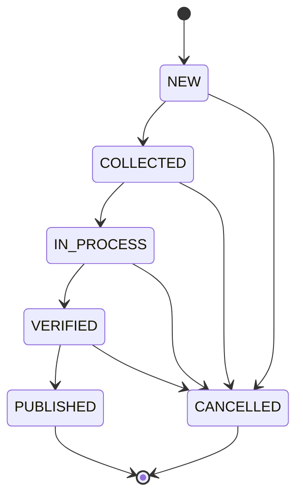

# LIMS Workflow Audit - Findings & Fix Plan

**Generated:** 2026-02-19  
**Purpose:** Prioritized findings with actionable fix recommendations

---

## Executive Summary

### Audit Scope
- ✅ Complete workflow trace from UI → API → Backend → DB
- ✅ Status consistency analysis across 5 entity types
- ✅ Source of truth validation
- ✅ Audit trail coverage assessment

### Overall Assessment: **GOOD with IMPROVEMENTS NEEDED** 🟡

**Strengths:**
- ✅ Centralized order status aggregation via `_recalculate_order_status()`
- ✅ Comprehensive audit event emission
- ✅ Transaction safety with `select_for_update()` in critical paths
- ✅ Model-level validation for immutability (FINAL results, RECEIVED samples)
- ✅ Clear status transition rules documented in code

**Weaknesses:**
- ⚠️ Dual write paths for Order status create inconsistency risk
- ⚠️ Direct status writes bypass validation and audit
- ⚠️ Frontend status mapping loses granularity (DRAFT=ENTERED, VERIFIED=FINAL)
- ⚠️ OrderItem status recalculation not always triggered
- ⚠️ Missing service layer for Dispatch status

---

## Priority 1: CRITICAL FIXES (Must Fix)

### Finding 1.1: Dual Order Status Write Paths 🔴

**Severity:** CRITICAL  
**Risk:** Data inconsistency, missing audit trail, validation bypass

**Description:**
Two different service functions write `Order.status`, creating risk of inconsistent behavior:
1. `OrderWorkflowService._transition_order()` (internal use)
2. `transition_visit_state()` (API-exposed)

**Evidence:**
```
File: apps/orders/workflow.py:243
  OrderWorkflowService._transition_order(order, new_status, user)

File: apps/orders/services.py:51
  transition_visit_state(order, new_status, user)

File: apps/orders/views.py:93
  OrderViewSet.perform_update() calls transition_visit_state()
```

**Impact:**
- Different validation rules may apply
- Audit events may differ
- Code maintainability suffers
- Risk of using wrong function in new code

**Root Cause:**
- Historical refactoring left both functions in place
- No clear documentation on which to use

**Fix Plan:**

**Step 1:** Consolidate into single entry point
```python
# File: apps/orders/workflow.py
class OrderWorkflowService:
    @staticmethod
    def transition_order(order, new_status, user, reason=None):
        """
        CANONICAL method to transition order status
        All order status writes MUST use this method
        """
        with transaction.atomic():
            order = Order.objects.select_for_update().get(pk=order.pk)
            
            # Validate transition
            if not order.can_transition_to(new_status):
                raise ValidationError(
                    f"Cannot transition order from {order.status} to {new_status}"
                )
            
            old_status = order.status
            order.status = new_status
            order.save()
            
            # Emit audit event
            emit_audit_event(
                event_type='ORDER_STATUS_CHANGED',
                entity_type='order',
                entity_id=order.id,
                user=user,
                tenant=order.tenant,
                details={
                    'old_status': old_status,
                    'new_status': new_status,
                    'reason': reason
                }
            )
            
            return order
```

**Step 2:** Deprecate `transition_visit_state()`
```python
# File: apps/orders/services.py
@deprecated("Use OrderWorkflowService.transition_order() instead")
def transition_visit_state(order, new_status, user):
    from apps.orders.workflow import OrderWorkflowService
    return OrderWorkflowService.transition_order(order, new_status, user)
```

**Step 3:** Update all callers
```python
# File: apps/orders/views.py
def perform_update(self, serializer):
    from apps.orders.workflow import OrderWorkflowService
    if 'status' in serializer.validated_data:
        OrderWorkflowService.transition_order(
            order=serializer.instance,
            new_status=serializer.validated_data['status'],
            user=self.request.user
        )
```

**Verification:**
- [ ] Grep for `transition_visit_state` calls
- [ ] Update all references
- [ ] Run integration tests
- [ ] Verify audit events still emitted

**Estimated Effort:** 4 hours  
**Files to Change:** 3 files (workflow.py, services.py, views.py)

---

### Finding 1.2: Direct Status Writes Bypass Services 🔴

**Severity:** CRITICAL  
**Risk:** Missing audit trail, validation bypass, inconsistent behavior

**Description:**
Multiple locations directly assign status fields without calling transition services:

**Evidence:**
```python
# File: apps/orders/workflow.py:30
sample.status = SampleStatus.RECEIVED
sample.save()

# File: apps/orders/workflow.py:87
result.status = ResultStatus.ENTERED
result.save()

# File: apps/orders/workflow.py:114
result.status = ResultStatus.VERIFIED
result.save()

# File: apps/results/views.py:541, 568
result.status = ResultStatus.ENTERED
result.save()
```

**Impact:**
- Audit events may not be emitted
- Validation rules may be skipped
- Timestamps (verified_at, entered_at) may not be set
- Inconsistent with other code paths

**Fix Plan:**

**Step 1:** Add status write guards in all service methods
```python
# File: apps/orders/workflow.py
def receive_sample(self, sample, user):
    # OLD:
    # sample.status = SampleStatus.RECEIVED
    # sample.save()
    
    # NEW:
    from apps.samples.services import transition_sample_state
    transition_sample_state(
        sample=sample,
        new_status=SampleStatus.RECEIVED,
        user=user
    )
    
    # Recalculate order status
    self._recalculate_order_status(sample.order_item.order)
```

**Step 2:** Update result entry to use transition service
```python
# File: apps/results/views.py (bulk_entry)
# OLD:
result.status = ResultStatus.ENTERED
result.entered_by = request.user
result.entered_at = timezone.now()
result.save()

# NEW:
from apps.results.services.transitions import transition_result_state
transition_result_state(
    result=result,
    new_status=ResultStatus.ENTERED,
    user=request.user
)
```

**Step 3:** Add linting rule to catch direct status writes
```python
# File: .pylintrc or custom linter
# Flag any line with pattern: `.status = ` outside of transition services
```

**Verification:**
- [ ] Grep for `.status = ` in codebase
- [ ] Update all direct assignments
- [ ] Run full test suite
- [ ] Verify audit events emitted for all transitions

**Estimated Effort:** 6 hours  
**Files to Change:** 5 files (workflow.py, views.py × 2, transitions.py)

---

### Finding 1.3: Result Status Frontend Mapping Loses Granularity 🔴

**Severity:** MEDIUM-HIGH  
**Risk:** Frontend cannot distinguish critical status differences

**Description:**
The `TestResultSerializer.get_status()` maps backend statuses to simplified frontend values:
- `DRAFT` → `"pending"`
- `ENTERED` → `"pending"` ⚠️ Same as DRAFT
- `VERIFIED` → `"verified"`
- `FINAL` → `"verified"` ⚠️ Same as VERIFIED

**Evidence:**
```python
# File: apps/results/serializers.py:51-60
def get_status(self, obj):
    status_map = {
        'DRAFT': 'pending',
        'ENTERED': 'pending',  # ⚠️ Loss of information
        'VERIFIED': 'verified',
        'FINAL': 'verified',   # ⚠️ Loss of information
    }
    return status_map.get(obj.status, obj.status)
```

**Impact:**
- Frontend cannot distinguish entered-but-unverified results from drafts
- Frontend cannot show "finalized" badge for immutable FINAL results
- UI may mislead users about actual workflow state

**Fix Plan:**

**Option A (Recommended):** Return full status with metadata
```python
# File: apps/results/serializers.py
class TestResultSerializer(serializers.ModelSerializer):
    status_display = serializers.SerializerMethodField()
    is_draft = serializers.SerializerMethodField()
    is_entered = serializers.SerializerMethodField()
    is_verified = serializers.SerializerMethodField()
    is_final = serializers.SerializerMethodField()
    
    def get_status_display(self, obj):
        # Return human-readable display text
        return obj.get_status_display()
    
    def get_is_draft(self, obj):
        return obj.status == ResultStatus.DRAFT
    
    def get_is_entered(self, obj):
        return obj.status == ResultStatus.ENTERED
    
    def get_is_verified(self, obj):
        return obj.status == ResultStatus.VERIFIED
    
    def get_is_final(self, obj):
        return obj.status == ResultStatus.FINAL
    
    class Meta:
        fields = [..., 'status', 'status_display', 'is_draft', 'is_entered', 'is_verified', 'is_final']
```

**Option B:** Use full status values in frontend
```python
# Remove status mapping entirely, use backend values directly
status = serializers.CharField(source='status')
```

**Frontend Update:**
```typescript
// File: frontend/src/pages/results/ResultsPage.tsx
const getStatusBadge = (status: string) => {
  switch (status) {
    case 'DRAFT':
      return <Badge color="gray">Draft</Badge>;
    case 'ENTERED':
      return <Badge color="blue">Entered</Badge>;
    case 'VERIFIED':
      return <Badge color="green">Verified</Badge>;
    case 'FINAL':
      return <Badge color="purple">Final</Badge>;
    default:
      return <Badge>{status}</Badge>;
  }
};
```

**Verification:**
- [ ] Update serializer
- [ ] Update frontend status display logic
- [ ] Test all status badges render correctly
- [ ] Verify no regressions in worklist/queue filtering

**Estimated Effort:** 3 hours  
**Files to Change:** 2 files (serializers.py, frontend components)

---

## Priority 2: HIGH-PRIORITY IMPROVEMENTS (Should Fix)

### Finding 2.1: OrderItem Status May Fall Out of Sync 🟡

**Severity:** MEDIUM  
**Risk:** Display inconsistencies, incorrect workflow state

**Description:**
`update_order_item_status()` is called after result transitions, but:
- Not called after bulk operations in some cases
- No scheduled consistency check to catch drift
- Manual status edits could bypass recalculation

**Evidence:**
```python
# File: apps/results/services/transitions.py:35-77
# Only called explicitly after certain operations
def update_order_item_status(order_item):
    # Derives status from results
    # BUT: only called when explicitly invoked
```

**Fix Plan:**

**Step 1:** Add consistency check management command
```python
# File: apps/orders/management/commands/check_status_consistency.py
class Command(BaseCommand):
    def handle(self, *args, **options):
        from apps.results.services.transitions import update_order_item_status
        from apps.orders.workflow import OrderWorkflowService
        
        # Check OrderItems
        inconsistent_items = []
        for item in OrderItem.objects.all():
            old_status = item.status
            update_order_item_status(item)
            item.refresh_from_db()
            if old_status != item.status:
                inconsistent_items.append((item.id, old_status, item.status))
        
        # Check Orders
        inconsistent_orders = []
        for order in Order.objects.all():
            old_status = order.status
            OrderWorkflowService._recalculate_order_status(order)
            order.refresh_from_db()
            if old_status != order.status:
                inconsistent_orders.append((order.id, old_status, order.status))
        
        self.stdout.write(
            f"Found {len(inconsistent_items)} inconsistent items, "
            f"{len(inconsistent_orders)} inconsistent orders"
        )
```

**Step 2:** Add post-migration signal
```python
# File: apps/orders/apps.py
class OrdersConfig(AppConfig):
    def ready(self):
        from django.db.models.signals import post_save
        from .signals import recalculate_on_result_save
        post_save.connect(recalculate_on_result_save, sender=TestResult)
```

**Verification:**
- [ ] Run consistency check on production data
- [ ] Fix any inconsistencies found
- [ ] Schedule daily consistency check cron job

**Estimated Effort:** 4 hours  
**Files to Change:** 3 files (new management command, apps.py, signals.py)

---

### Finding 2.2: Missing Dispatch Status Service 🟡

**Severity:** MEDIUM  
**Risk:** No validation, no audit trail for dispatch transitions

**Description:**
Dispatch status changes happen directly in `OrderViewSet` without a dedicated service:

**Evidence:**
```python
# File: apps/orders/views.py
# No transition service, direct writes
dispatch.status = 'IN_TRANSIT'
dispatch.save()
```

**Fix Plan:**

**Step 1:** Create dispatch transition service
```python
# File: apps/orders/services.py (or new file)
def transition_dispatch_state(dispatch, new_status, user):
    valid_transitions = {
        'CREATED': ['IN_TRANSIT'],
        'IN_TRANSIT': ['RECEIVED'],
        'RECEIVED': [],  # Terminal
    }
    
    if new_status not in valid_transitions.get(dispatch.status, []):
        raise ValidationError(
            f"Cannot transition dispatch from {dispatch.status} to {new_status}"
        )
    
    with transaction.atomic():
        dispatch = Dispatch.objects.select_for_update().get(pk=dispatch.pk)
        old_status = dispatch.status
        dispatch.status = new_status
        
        if new_status == 'IN_TRANSIT':
            dispatch.sent_at = timezone.now()
            dispatch.sent_by = user
        elif new_status == 'RECEIVED':
            dispatch.received_at = timezone.now()
            dispatch.received_by = user
        
        dispatch.save()
        
        emit_audit_event(
            event_type='DISPATCH_STATUS_CHANGED',
            entity_type='dispatch',
            entity_id=dispatch.id,
            user=user,
            tenant=dispatch.tenant,
            details={'old_status': old_status, 'new_status': new_status}
        )
```

**Step 2:** Update viewset actions
```python
# File: apps/orders/views.py
@action(detail=True, methods=['post'])
def send_dispatch(self, request, pk=None):
    dispatch = self.get_object()
    transition_dispatch_state(dispatch, 'IN_TRANSIT', request.user)
    return Response({'status': 'success'})
```

**Verification:**
- [ ] Test dispatch send/receive flow
- [ ] Verify audit events emitted
- [ ] Validate transition rules enforced

**Estimated Effort:** 3 hours  
**Files to Change:** 2 files (services.py, views.py)

---

## Priority 3: NICE-TO-HAVE IMPROVEMENTS (Consider)

### Finding 3.1: Inconsistent Transaction Boundaries 🟢

**Severity:** LOW  
**Risk:** Race conditions in high-concurrency scenarios

**Description:**
Some status writes use `select_for_update()`, others don't:

**Fix Plan:**
- Audit all status write locations
- Add `select_for_update()` to all critical sections
- Document locking strategy

**Estimated Effort:** 2 hours

---

### Finding 3.2: No Status Transition Diagram 🟢

**Severity:** LOW (documentation)  
**Risk:** Developer confusion, incorrect transitions

**Fix Plan:**
- Create Mermaid state machine diagrams for each entity
- Add to documentation
- Include in code comments

**Example:**


**Estimated Effort:** 2 hours

---

### Finding 3.3: Test Coverage for Immutability 🟢

**Severity:** LOW  
**Risk:** Regressions in immutability enforcement

**Fix Plan:**
- Add tests for all terminal states (FINAL, PUBLISHED, CANCELLED)
- Verify ValidationError raised on illegal transitions
- Test concurrent modification scenarios

**Estimated Effort:** 3 hours

---

## Implementation Roadmap

### Phase 1: Critical Fixes (Week 1)
- [ ] Finding 1.1: Consolidate Order status writes (4h)
- [ ] Finding 1.2: Remove direct status assignments (6h)
- [ ] Finding 1.3: Fix frontend status mapping (3h)
- **Total:** 13 hours

### Phase 2: High-Priority (Week 2)
- [ ] Finding 2.1: Add consistency check command (4h)
- [ ] Finding 2.2: Create Dispatch service (3h)
- **Total:** 7 hours

### Phase 3: Nice-to-Have (Week 3)
- [ ] Finding 3.1: Add transaction boundaries (2h)
- [ ] Finding 3.2: Create status diagrams (2h)
- [ ] Finding 3.3: Add immutability tests (3h)
- **Total:** 7 hours

**Grand Total:** 27 hours (~3.5 developer days)

---

## Testing Strategy

### Unit Tests
- [ ] Test each transition service independently
- [ ] Test validation rules (valid/invalid transitions)
- [ ] Test audit event emission
- [ ] Test timestamp setting (verified_at, entered_at, etc.)

### Integration Tests
- [ ] Test end-to-end workflow (patient → report)
- [ ] Test status recalculation cascades
- [ ] Test concurrent modification scenarios
- [ ] Test rollback on validation errors

### Regression Tests
- [ ] Verify existing workflows still work
- [ ] Verify API responses unchanged (except status mapping)
- [ ] Verify frontend still displays correctly

---

## Rollout Plan

### Pre-Deployment
1. Run consistency check on production DB
2. Fix any existing inconsistencies
3. Deploy database migrations (if any)

### Deployment
1. Deploy backend changes
2. Deploy frontend changes (if status mapping changed)
3. Monitor error logs for unexpected ValidationErrors

### Post-Deployment
1. Run consistency check daily for 1 week
2. Monitor audit logs for status transition patterns
3. Alert on any failed transitions

---

## Success Metrics

### Quantitative
- [ ] 100% of status writes go through services
- [ ] 100% of status changes have audit events
- [ ] 0 direct `.status = ` assignments in production code
- [ ] 0 inconsistencies found in daily consistency check

### Qualitative
- [ ] Developers can easily find correct transition function
- [ ] Code reviewers can verify status changes use services
- [ ] Frontend accurately reflects backend status
- [ ] Audit trail is complete and queryable

---

## Risk Mitigation

### Risk: Breaking Existing Workflows
**Mitigation:**
- Comprehensive integration tests before deployment
- Staged rollout (dev → staging → production)
- Feature flag for new transition logic

### Risk: Performance Degradation
**Mitigation:**
- Benchmark transition service performance
- Monitor database lock wait times
- Add indices on status columns if needed

### Risk: Data Inconsistency During Migration
**Mitigation:**
- Run consistency check before deployment
- Fix inconsistencies in maintenance window
- Deploy during low-traffic period

---

## Appendix: Code Locations Reference

### Status Write Locations (All)
```
Order:
  - apps/orders/workflow.py:243 (OrderWorkflowService._transition_order)
  - apps/orders/services.py:51 (transition_visit_state)
  - apps/orders/models.py:335 (Order.transition_to)

Sample:
  - apps/samples/services.py:84-164 (transition_sample_state)
  - apps/orders/workflow.py:30, 61 (direct writes ⚠️)
  - apps/samples/views.py:85 (via transition_sample_state ✅)

TestResult:
  - apps/results/services/transitions.py:103-141 (transition_result_state)
  - apps/orders/workflow.py:87, 114, 169 (direct writes ⚠️)
  - apps/results/views.py:541, 568 (direct writes ⚠️)
  - apps/results/views.py:701, 749 (via transition_result_state ✅)

OrderItem:
  - apps/results/services/transitions.py:35-77 (update_order_item_status)

Report:
  - apps/reports/services.py:13-100+ (transition_report_state)
  - apps/reports/views.py:388, 392 (via transition_report_state ✅)

Dispatch:
  - apps/orders/views.py (direct writes ⚠️)
```

---

**END OF FINDINGS_AND_FIX_PLAN.md**
